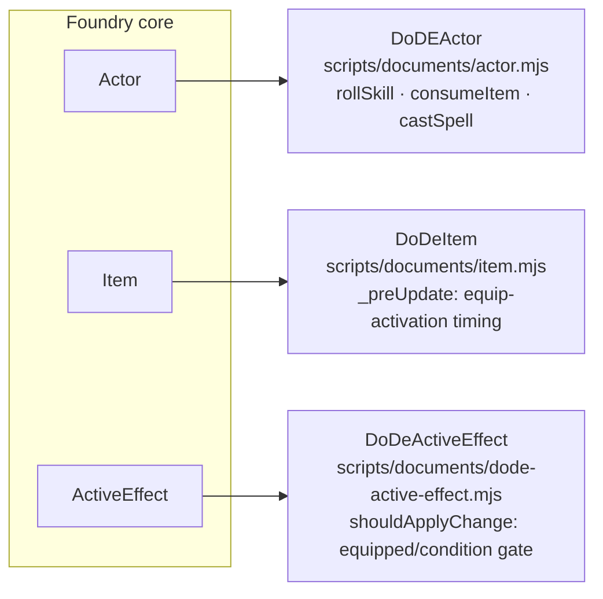
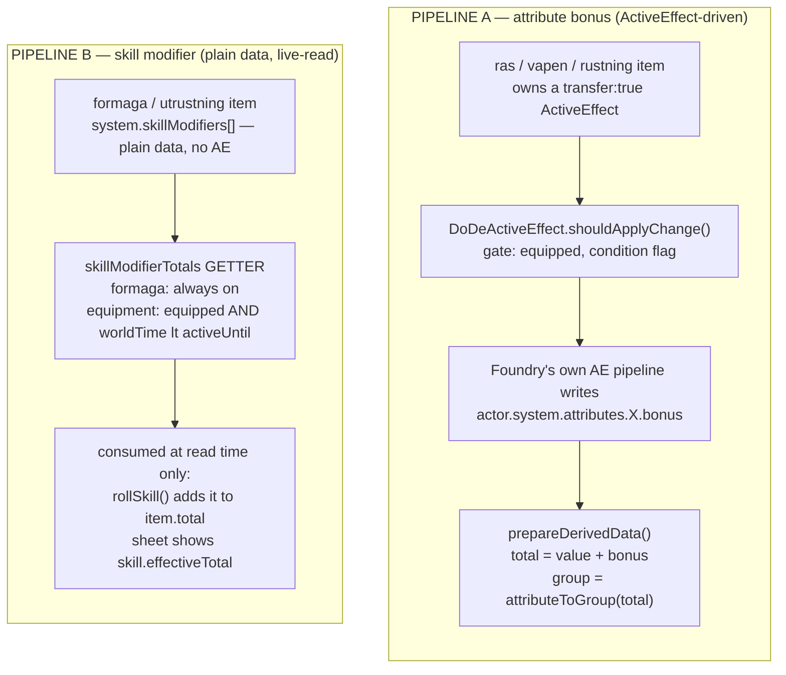
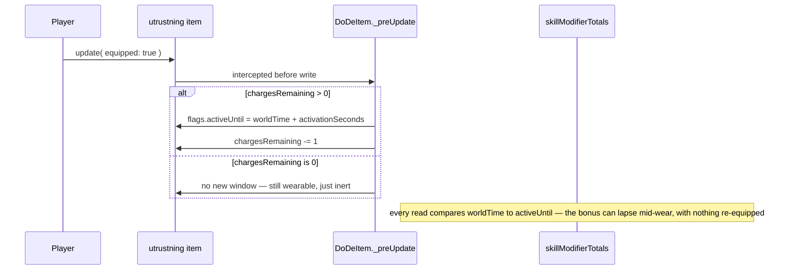

# Data Model & Architecture

> Living reference — regenerate/update this when the shape of the code changes, don't let it drift into fiction. Read `CLAUDE.md` first for the project's actual authoritative status source (`docs/DESIGN_DECISIONS.md`); this file exists purely to make the *shape* of the data model visible at a glance, since the code alone gets hard to hold in your head once two systems start looking similar but aren't.

Last drawn: 2026-07-31 (session 21, backlog 7 + 36). Covers the Actor/Item data model and, in particular, the two modifier pipelines that are easy to conflate: attribute bonuses (old, ActiveEffect-driven) and skill modifiers (new, plain-data and live-read).

---

## 1. Document classes

Three Foundry core documents are subclassed; everything else is a `TypeDataModel` registered against one of the two document classes. `DoDeItem` is the newest of the three, added in session 21 purely to time-box a bonus when equipment gets worn.



| Type key | DataModel | Registered on | Carries `skillModifiers`? |
|---|---|---|---|
| `character` | `actor-character.mjs` | `CONFIG.Actor.dataModels` | — |
| `npc` | `actor-npc.mjs` | `CONFIG.Actor.dataModels` | — |
| `handlare` | `actor-handlare.mjs` | `CONFIG.Actor.dataModels` | — |
| `fardighet` | `item-fardighet.mjs` | `CONFIG.Item.dataModels` | no — read target, never written |
| `formaga` | `item-formaga.mjs` | `CONFIG.Item.dataModels` | yes — always active |
| `utrustning` | `item-utrustning.mjs` | `CONFIG.Item.dataModels` | yes — equipped-gated, timed, consumable |
| `vapen` | `item-vapen.mjs` | `CONFIG.Item.dataModels` | shape ready, unused today |
| `rustning` | `item-rustning.mjs` | `CONFIG.Item.dataModels` | shape ready, unused today |
| `ras` / `yrke` | `item-ras.mjs` / `item-yrke.mjs` | `CONFIG.Item.dataModels` | attributeMods only, via AE |
| `besvarjelse` / `minibesvarjelse` | `item-besvarjelse(-mini).mjs` | `CONFIG.Item.dataModels` | spellEffect, own pipeline |

---

## 2. What an Actor owns

A `character` Actor embeds items of eight types, plus transient ActiveEffects. Race and profession are singular by convention (the sheet swaps them on drop, see `actor-character-sheet.mjs#onDropItem`); everything else can repeat. Fields shown are the ones relevant to this diagram, not the full schema — see each `item-*.mjs` for the rest.

```mermaid
erDiagram
  ACTOR {
    string documentType "character | npc | handlare"
    object attributes "sty fys smi int psy kar sto"
    array specialAbilities "name source description slotId"
    object skillModifierTotals "GETTER, summed on every read"
  }
  RAS {
    object attributeMods "per-attribute delta"
    array effects "transfer AE, gated on nothing"
  }
  YRKE {
    array professionSkills "named or choiceCount slots"
    string baseProfession "groups specialisations"
  }
  FARDIGHET {
    string skillKey
    number fv "EP-bought base"
    number bonus "manual, player-edited"
    number total "fv + bonus, derived only"
    string costTier "primar | yrkesfardighet | sekundar"
  }
  FORMAGA {
    string origin "bas | ras | yrke | hjalte"
    array skillModifiers "skillKey,value pairs"
    string specialAbilitySlot "flag: stable slotId tag"
  }
  VAPEN {
    boolean equipped
    string damage
    array skillModifiers "unused today"
  }
  RUSTNING {
    boolean equipped
    number abs
    array skillModifiers "unused today"
  }
  UTRUSTNING {
    boolean equipped
    array skillModifiers "NEW 2026-07-31"
    number chargesRemaining "null = unlimited"
    number activationSeconds "null = permanent while worn"
    boolean consumable
    array effectChanges "AE defs, dollar-CHOICE placeholder"
  }
  BESVARJELSE {
    array spellEffect
    number spellDuration
  }

  ACTOR ||--o| RAS : "embeds 0..1"
  ACTOR ||--o| YRKE : "embeds 0..1"
  ACTOR ||--o{ FARDIGHET : "embeds many"
  ACTOR ||--o{ FORMAGA : "embeds many"
  ACTOR ||--o{ VAPEN : "embeds many"
  ACTOR ||--o{ RUSTNING : "embeds many"
  ACTOR ||--o{ UTRUSTNING : "embeds many"
  ACTOR ||--o{ BESVARJELSE : "embeds many"
```



---

## 3. The two modifier pipelines

This is the part that got complex enough to need drawing. Both pipelines end up adding a number to something on the Actor, but they get there by completely different means, and neither writes into the other's territory.



> **The one rule that matters:** `fardighet.total` (`fv + bonus`) never changes because of a skill modifier. The two numbers are only ever added together at the moment something is rolled or displayed — not stored, not merged, not written back.

> **Why B is a getter, not a field:** a value written during `prepareDerivedData()` only updates when that document is itself created, updated, or deleted. It does not update when `game.time.worldTime` advances on its own. A cached "does Duntofflor's 30-minute window still apply" would go stale the moment nobody touched the actor. Core's own `ActiveEffect#duration`/`#active` avoid this by being real getters too — Pipeline B copies that pattern deliberately. See `DESIGN_DECISIONS.md` §6 for the full write-up of the bug this fixed.

Backlog 7 is only half-closed by this: `formaga` and `utrustning` are wired into Pipeline B because they're the two source types that actually have content today. `ras`/`yrke` could carry the same `skillModifiers` field the day something like Skogsalv's +10 CL Gömma sig needs it — no further architecture required, just the field and the content.

⚠ Not yet diagrammed as its own pipeline (pre-existing gap, not new tonight): a **parallel, structurally-identical** mechanism, `statModifiers` (`{stat: "hp.max"|"psy.max"|"movement", operation, value}`), consumed by `actor-character.mjs`'s `#applyStatModifiers` — same item-scan-plus-`equipped`/`activationSeconds`-gate shape as Pipeline B above, just targeting a derived resource field instead of a named skill's total. `item-formaga.mjs` has carried it since the ras/yrke abilities pass (backlog 70/71); `item-utrustning.mjs` gained it 2026-08-22 (a wearable "+3 PSY" staff, live-demo loot) — the consumer already scanned `utrustning`-typed items, only the schema field was missing. `"movement"` added 2026-09-06 (backlog 91, the encumbrance/battlemap pass) — an item-driven movement modifier (a cursed boot, a pair of winged sandals) needs no new machinery, just a third enum value.

**New 2026-09-06, also not yet diagrammed as its own pipeline:** `carriedWeight`/`encumbrance` (`{carried, capacity, step, modifier, noSwimRunSprint, noSmiSkills}`), derived in `actor-character.mjs#prepareDerivedData` from `DODE.encumbranceTable`/`encumbranceStep()` (config.mjs). Sums owned `vapen`/`rustning` (half weight if `equipped`)/`utrustning` (excluding `category:"kladsel"`) against `carryCapacity` (STY in kg). Feeds TWO consumers: the final `movement` value directly, and a new CL-modifier bucket in Pipeline B's `#computeSkillModifiers()` for every owned `fardighet` item with `attribute:"smi"` — deliberately NOT applied to `smi.total` itself, to avoid double-counting through `movementSum` (which already sums `smi.total`). A hook-driven (`createItem`/`updateItem`/`deleteItem`/`updateActor` in `dode.mjs`) `belastad` token status mirrors `encumbrance.step` — written from hooks rather than `prepareDerivedData` itself, same write-storm avoidance already established for `skillModifierTotals`.

**New 2026-09-06 (backlog 118, Steg 2):** `system.canSwim` (`{value, armorBlocks, loadBlocks}`) on `actor-character.mjs`, combining two independent book-sourced gates — any equipped `rustning` item (RP s.55, unconditional on weight) OR `encumbrance.noSwimRunSprint` (SPB s.44, load-based, from the field above). Purely informational, no mechanical block. Separately, `actor-npc.mjs#prepareDerivedData` gained a live getter `movementParsed` (`{land, fly, swim, burrow, any, parsed, raw}`) via the new `DODE.parseNpcMovement()` (config.mjs), parsing the free-text `movement` field's `L/F/S/B/A` codes — deliberately a live re-parse of the existing string field, not stored/migrated data, since a spot-check of all 241 `packs/monster/_source/*.json` entries found the source text too inconsistent (mixed code order, parenthetical burst/conditional exceptions, some entries pure prose with no code at all) to force into a strict schema without a full manual retranscription; `parsed:false` on anything unparseable, consumers must handle that rather than assume a value. `DoDETokenRuler#movementBudget` (token-ruler.mjs) consumes `movementParsed`, keyed by the current waypoint's own movement `action` (walk/fly/swim/burrow) — this also fixed a real bug shipped in the Steg 1 session, where the ruler divided by the raw NPC `movement` string (`cost / "L36"` → silent `NaN` → every NPC token rendered its drag path in the "outside the round" dark-red tier regardless of actual distance).

**New 2026-09-06 (backlog 118c, mounts):** a genuinely new architectural pattern — a rider↔mount relationship expressed as a single flag (`flags.<system.id>.mountedOn`, the mount token's id) on the RIDER's `TokenDocument`, not a schema field on either actor's DataModel. No relational data model needed; `game.dode.mountToken()`/`dismountToken()` (dode.mjs) set/clear it, and an `updateToken` hook auto-displaces every token flagged onto a moved token to the same position (`action:"displace"`, cost 0). Three Foundry gotchas surfaced building this, all now commented in place at the hook: `action:"displace"` does not ignore walls on its own (needs an explicit `constrainOptions:{ignoreWalls:true}`); a token's own `.x`/`.y` getters are stale inside that same token's own `updateToken` hook (read `changes`/`_source` instead — the same class of bug already documented for `elevation` in `anatomy.mjs#tokenDistance`); and `TokenDocument#move()` permanently freezes the options object it's given (`Object.defineProperty`/`deepFreeze`), so reusing one options object across multiple `.move()` calls silently breaks the second call — a factory function (`mountDisplaceOptions()`) must build a fresh object per call.

---

## 4. From table row to formaga item

A särskild förmåga starts as one row in `DODE.specialAbilitiesTable` (`config.mjs`). Rows with an `effect` resolve into a `formaga` item feeding Pipeline B; the other 34 of 49 rows are still pure flavor text.

```mermaid
sequenceDiagram
  participant Table as specialAbilitiesTable
  participant UI as wizard step / "Slå fram"
  participant Resolver as special-ability-effects.mjs
  participant Actor

  UI->>UI: roll 2d20 + spent BP
  UI->>Table: match row by range
  Table-->>UI: name, description, effect?
  opt effect.pool is set
    UI->>UI: ask player for the choice(s)
  end
  UI->>Resolver: resolveGrants(effect, choices)
  Resolver-->>UI: skillModifiers[], fardighetSeeds[]
  UI->>Resolver: applyResolvedAbility(actor, slotId, ...)
  Resolver->>Actor: ensure each seed exists as fardighet (fv 0)
  Resolver->>Actor: create/update ONE formaga item, tagged flags.specialAbilitySlot = slotId
  Note over Actor: Pipeline B picks this up on the very next read — no further wiring needed
```

`slotId` — not the row's array index — is what ties a formaga item back to its slot, because both the wizard's slot list (shrinks on a level drop) and the sheet's ability list (grows/shrinks freely) can reorder. Re-rolling a slot replaces its formaga item in place; removing a slot prunes the orphan without ever touching the fardighet it seeded (`pruneOrphanedAbilityGrants`).

---

## 5. A timed, charge-limited bonus in practice

Runas Duntofflor (`packs/magiska-foremal/_source/`) was the test case for Pipeline B's hardest edge: a bonus that should fade a fixed time after equipping, without the item ever being taken off.



---

## 6. File map

| Path | What lives there |
|---|---|
| `scripts/data/actor-character.mjs` | the two skillModifier getters; attribute bonus aggregation; `effectiveResistances` getter (2026-09-05 — merges the actor's own rarely-used `system.resistances` with resistances carried by owned `formaga` items, same live-getter shape as `skillModifierTotals`) |
| `scripts/data/item-formaga.mjs` | `skillModifiers` field, "always active" source; `resistances` field (2026-09-05, backlog 88 — Kaos Väktare's magical tattoos, reuses `fields-resistances.mjs`'s shared shape rather than inventing a fourth modifier pipeline); `statModifiers.stat` gained `"movement"` (2026-09-06, backlog 91) |
| `scripts/data/item-utrustning.mjs` | `skillModifiers`, `statModifiers` (2026-08-22 — hp.max/psy.max add/multiply, same shape and consumer as `item-formaga.mjs`'s, see below; `"movement"` added 2026-09-06, backlog 91), `chargesRemaining`, `activationSeconds`, `consumable`, `effectChanges`; `weight` migrated BEP→kg ×3 (2026-09-06, backlog 91/117 — see `DODE.encumbranceTable` for the source-book discrepancy this migration deliberately did not resolve) |
| `scripts/documents/item.mjs` | `DoDeItem` — equip-activation timing hook |
| `scripts/documents/dode-active-effect.mjs` | `DoDeActiveEffect` — Pipeline A's equip/condition gate |
| `scripts/documents/actor.mjs` | `rollSkill` (reads Pipeline B), `consumeItem`, `castSpell` |
| `scripts/helpers/special-ability-effects.mjs` | `resolveGrants` / `applyResolvedAbility` / `pruneOrphanedAbilityGrants` |
| `scripts/helpers/config.mjs` | `DODE.specialAbilitiesTable`, the 15 annotated `effect` rows |
| `packs/magiska-foremal/_source/` | Runas Duntofflor, Drakpotion — the two proof-of-concept items |

---

Drawn from the codebase as of commit `9519137` (backlog 7 + 36). If you're reading this after several more sessions of skill-modifier or ActiveEffect work, check `git log -- scripts/data/actor-character.mjs scripts/documents/item.mjs` before trusting the diagrams above — regenerate rather than patch piecemeal once the pipelines change shape again.
